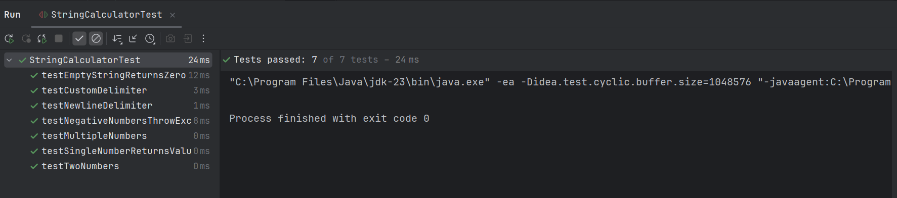

# String Calculator TDD Kata

This project implements a String Calculator using Test-Driven Development (TDD).

## Features Implemented
- Handles empty strings
- Handles one or more comma-separated numbers
- Supports newline as delimiter
- Supports custom delimiters
- Throws exception on negative numbers

## How to Run
- Use `mvn test` (if using Maven) or run via IDE

## Screenshots

